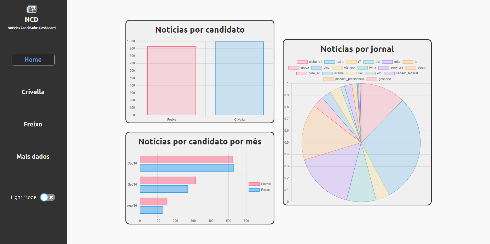
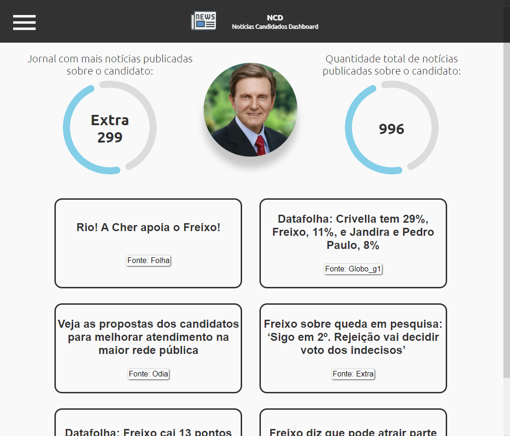

# Noticias Candidatos Dashboard

Esse App disponibiliza uma interface com estatísticas e gráficos, consumindo a REST API disponibilizada neste [Repositório](https://github.com/AdrielGAmorim/noticias-candidatos-RESTAPI/).


## Para execução do App

### Serão necessários os seguintes pré-requisitos:

* VsCode ou sua IDE de preferência;

* Node.js instalado.

* Para o correto funcionamento do App, você deverá se encaminhar para este [Repositório](https://github.com/AdrielGAmorim/noticias-candidatos-RESTAPI/), e seguir as instruções para iniciar o REST API Server.


### Execução

* Com o REST API Server ligado;

* Clone esse repositório para sua máquina;

* No VsCode com a pasta do projeto aberta, abra o console e digite:

```shell script
npm run start
```

* Em seguida, abra seu navegador, copie o endereço abaixo cole na area de endereço no seu navegador e aperte ENTER;

```
http://localhost:3000/
```

* Você terá acesso ao App.


## Links

- Link do repositório da REST API: [Aqui](https://github.com/AdrielGAmorim/noticias-candidatos-RESTAPI/)


## Screenshots

### Desktop preview 

<sub>*Apenas preview, app pode ter passado po pequenas alterações</sub>

### Tablet/ Laptop preview 

<sub>*Apenas preview, app pode ter passado po pequenas alterações</sub>

### Mobile preview 

<sub>*Apenas preview, app pode ter passado po pequenas alterações</sub>


## Criado com

- [Node.js](https://nodejs.org/pt-br/docs/)
- [React-Router-Dom](https://nodejs.org/https://v5.reactrouter.com/web/guides/quick-start)
- [React ChartJs 2](https://react-chartjs-2.js.org)
- [Styled Components](https://styled-components.com)
- [Material UI](https://mui.com/pt/)


## Author

- Adriel Amorim - [Portfolio](https://adrielgamorim.github.io/Portfolio/)
- Adriel Amorim - [LinkedIn](https://www.linkedin.com/in/adrielamorim/)
